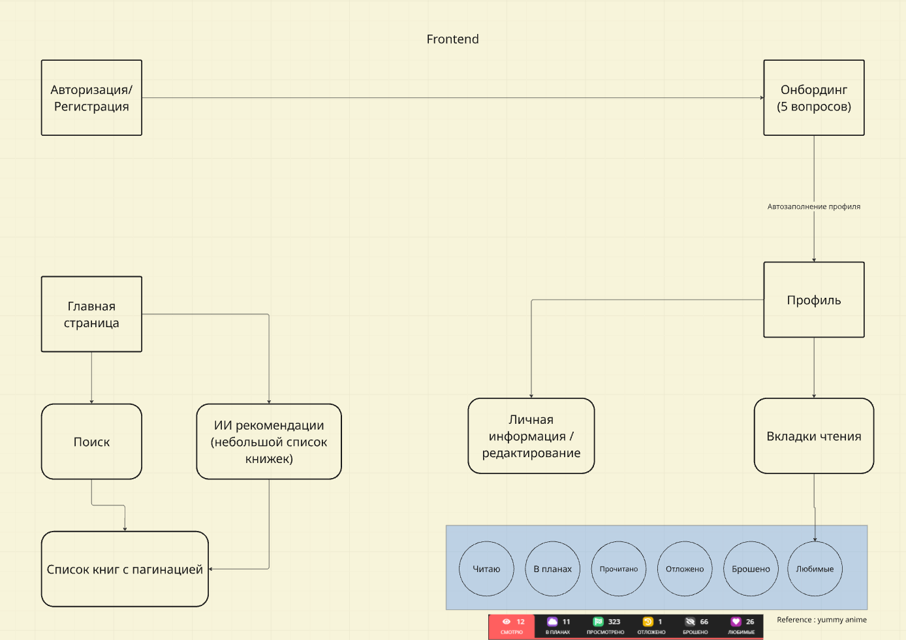

# Quick start

Install dependencies:

`yarn install`

Run application:

`yarn dev`

Run tests:

`yarn test`

## BroJS Deployment

This project is configured for deployment to BroJS platform at admin.brojs.ru.

### Setup

1. Project is already created on admin.brojs.ru with name `read-mind-ai`
2. GitHub repository is linked in the BroJS admin panel
3. Deployments are triggered automatically through the BroJS platform when pushing to the connected branch

### Build Configuration

BroJS will automatically:
- Install dependencies using `yarn install`
- Build the project using `yarn build`
- Deploy the Nuxt output from `.output` directory

Make sure your production environment variables are configured in the BroJS admin panel.

# Презентация

https://gamma.app/docs/ReadMind-AI-1kfhtt5qwr3w7b9

# Идея проекта

## ReadMind AI

### AI-powered персональный литературный ассистент

## Монетизация

### Freemium модель:

- Free: базовый поиск, 3 саммари книги/месяц
- Pro ($15/мес): безлимитные саммари, ИИ поиск
- Teams ($49/мес): корпоративные клубы по интересам, хранение документации с автоматической ИИ разметкой

Цель: 135K платных пользователей = $2M MRR

#### Дополнительные потоки:

- Сотрудничество с книжными магазинами (Amazon, Audible) — 8-10% комиссия
- Продвигать спонсоров в рекомендациях
- API для образовательных платформ

### MVP

**Фронтенд архитектура:**


**Бекенд архитектура:**


Все приблизительно, но для понимания достаточно

#### Онбординг с вопросами

- 5 вопросов для профиля читателя
- Сохранение ответов в базу
- Простой UI

#### AI-рекомендации

- Deepseek API генерирует 5-7 книг на основе ответов
- Показываем: обложка, название, автор, краткое обоснование (“почему эта книга”)
- Источник данных: Google Book API (надо проверить)

#### Личный список чтения

- Добавление книг в “Хочу прочитать” (в любую другую категорию)
- 6 статусов: Читаю / В планах / Прочитано / Отложено / Брошено / Любимое

#### Авторизация

- Email + пароль


### Todo: декомпозиция задач

Фронтенд:

1) Страница авторизации/регистрации
2) Страница онбординга (перелистывание между несколькими вопросами, хранение ответов)
3) Скелет страницы профиля (информация о человеке - ее редактирование, вкладки статусов)
4) Карточка книги (ее мини представление в списке, а также модалка с более подробной информацией, которая появляется при нажатии)
5) Навбар (кнопки перехода на профиль, компонент поиска, лого, ...)
6) Ленивый список книг (компонент со скелетоном, ленивой подгрузкой обложек книг и другой информации, стор для связи с компонентов поиска)

Бекенд:

1) Авторизация/регистрация
2) Ручка для получения книг с фильтрами и пагинацией (интеграция с Deepseek API и книжным API)
3) ручка для получения информации профиля
4) ручка для редактирования профиля
5) сервис онбординга

## Deployment on Ubuntu Server

### Prerequisites
- Node.js 18+ installed
- PM2 installed globally: `npm install -g pm2`
- Caddy web server (for reverse proxy)

### Deployment Steps

1. **Clone the repository**
```bash
git clone <your-repo-url>
cd enterprise-javascript-startup
```

2. **Install dependencies**
```bash
npm install
# or
yarn install
```

3. **Set up environment variables**
```bash
cp .env.example .env
nano .env
# Add your actual values:
# SUPABASE_URL=your_supabase_url
# SUPABASE_KEY=your_supabase_anon_key
# BOOKS_API_KEY=your_google_books_api_key
```

4. **Build the application**
```bash
npm run build
# or
yarn build
```

5. **Start with PM2**
```bash
pm2 start ecosystem.config.cjs
pm2 save
pm2 startup  # Follow the instructions to enable auto-start on reboot
```

6. **Configure Caddy** (if using domain)
```bash
sudo nano /etc/caddy/Caddyfile
```

Add your domain configuration:
```
your-domain.com {
    reverse_proxy 127.0.0.1:8742
}
```

Then reload Caddy:
```bash
sudo caddy fmt --overwrite /etc/caddy/Caddyfile
sudo systemctl reload caddy
```

### Managing the Application

- **View logs**: `pm2 logs readmind`
- **Restart app**: `pm2 restart readmind`
- **Stop app**: `pm2 stop readmind`
- **Monitor**: `pm2 monit`
- **Update deployment**:
  ```bash
  git pull
  npm install
  npm run build
  pm2 restart readmind
  ```